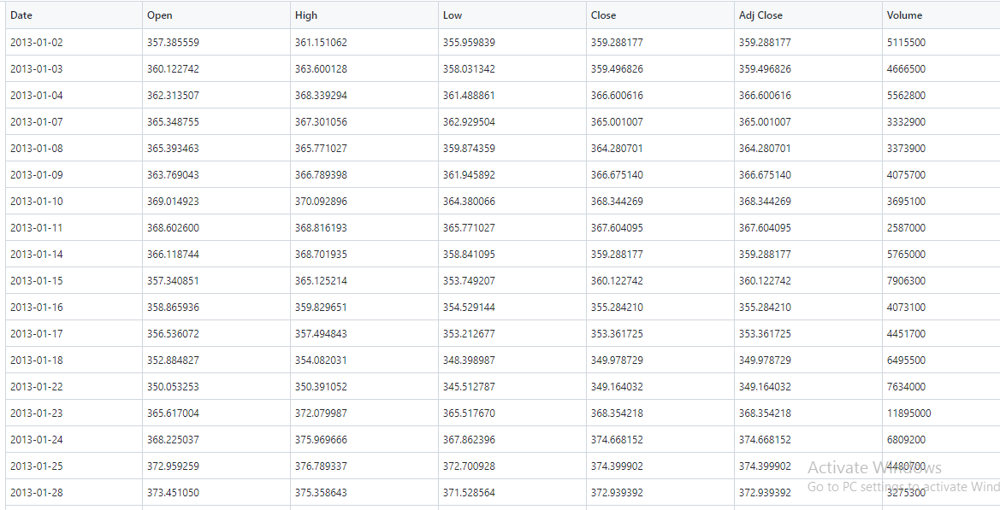
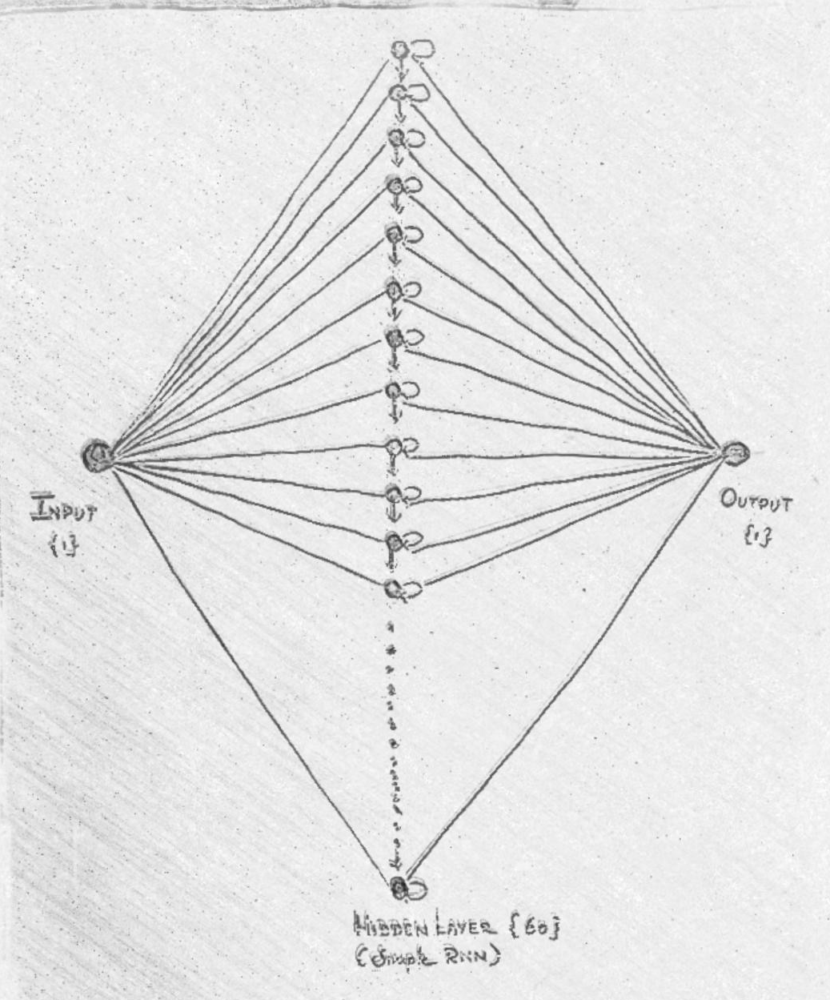
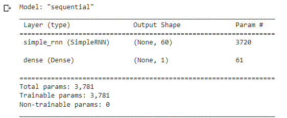

# Stock Price Prediction

## AIM

To develop a Recurrent Neural Network model for stock price prediction.

## Problem Statement 

In todays worls stock market moves into technology field to enhance it.Like ML and DL are very efficient in predicting the stock price based on some featues.so in this project we are going the predict the stock price of Google with collected data on past years.By using the Recurrent Neural Network in Deep Learning

##  Dataset:


## Neural Network Model



## DESIGN STEPS

### STEP 1:
Download and load the dataset to colab. After that mount the drive in your colab workspace to access the dataset.

### STEP 2:
Use ImageDataGenerator to augment the data and flow the data directly from the dataset directory to the model

### STEP 3:
Split the data into train and test.

### STEP 4:
Build the Recurrent Neural network model

### STEP 5:
Train the model with training data

### STEP 6:
Evaluate the model with testing data

### STEP 7:
Plot the graph of train and test models

## PROGRAM
```python
Developed by: Silambarsan K
Roll No: 212221230101

import numpy as np
import matplotlib.pyplot as plt
import pandas as pd
from sklearn.preprocessing import MinMaxScaler
from keras import layers
from keras.models import Sequential

dataset_train = pd.read_csv('trainset.csv')
dataset_train.columns
dataset_train.head()

train_set = dataset_train.iloc[:,1:2].values
type(train_set)
train_set.shape
training_set_scaled.shape

X_train_array = []
y_train_array = []

for i in range(60, 1259):
  X_train_array.append(training_set_scaled[i-60:i,0])
  y_train_array.append(training_set_scaled[i,0])
X_train, y_train = np.array(X_train_array), np.array(y_train_array)
X_train1 = X_train.reshape((X_train.shape[0], X_train.shape[1],1))
X_train.shape
length = 60
n_features = 1

model=Sequential()
model.add(layers.SimpleRNN(60,input_shape=(60,1)))
model.add(layers.Dense(1))
model.compile(optimizer='adam',loss='mse')
model.summary()
model.fit(X_train1,y_train,epochs=100, batch_size=32)

dataset_test = pd.read_csv('testset.csv')
test_set = dataset_test.iloc[:,1:2].values
test_set.shape
dataset_total = pd.concat((dataset_train['Open'],dataset_test['Open']),axis=0)

inputs = dataset_total.values
inputs = inputs.reshape(-1,1)
inputs_scaled=sc.transform(inputs)
X_test = []

for i in range(60,1384):
  X_test.append(inputs_scaled[i-60:i,0])
X_test = np.array(X_test)
X_test = np.reshape(X_test,(X_test.shape[0], X_test.shape[1],1))
X_test.shape

predicted_stock_price_scaled = model.predict(X_test)
predicted_stock_price = sc.inverse_transform(predicted_stock_price_scaled)

plt.plot(np.arange(0,1384),inputs, color='red', label = 'Test(Real) Google stock price')
plt.plot(np.arange(60,1384),predicted_stock_price, color='blue', label = 'Predicted Google stock price')
plt.title('Google Stock Price Prediction')
plt.xlabel('Time')
plt.ylabel('Google Stock Price')
plt.legend()
plt.show()


```

## OUTPUT

### MODEL:


### GRAPH:

## RESULT
Thus Recurrent Neural Network Model is developed for stock price prediction.
